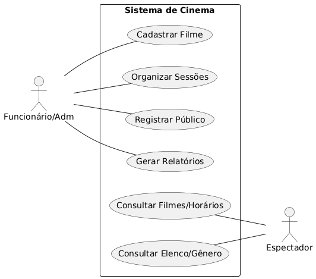
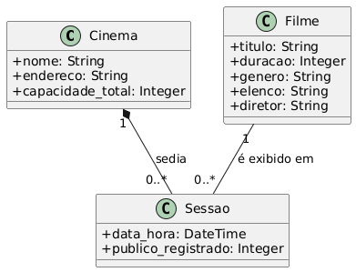
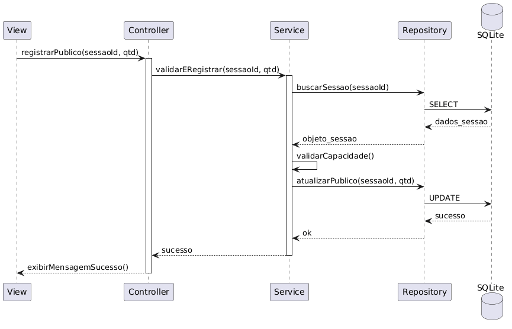

# Sistema de Gestão - Rede de Cinemas 🎬

Este projeto consiste em um sistema de informação para gerenciamento de uma rede de cinemas, abrangendo desde o controle de filmes e sessões até o registro de público. Desenvolvido como atividade prática da disciplina de Engenharia de Software.

## 📌 1. Levantamento de Requisitos

### Requisitos Funcionais (RF)
* **RF01:** Cadastrar e listar cinemas (unidades).
* **RF02:** Manter cadastro de filmes (título, duração, gênero, elenco).
* **RF03:** Agendar sessões de filmes por cinema.
* **RF04:** Registrar o público diário de cada sessão.
* **RF05:** Gerar relatórios de público total por filme e cinema.

### Regras de Negócio (RN)
* **RN01:** O intervalo entre sessões na mesma sala deve ser de, no mínimo, 20 minutos.
* **RN02:** O registro de público não pode exceder a capacidade máxima da sala do cinema.
* **RN03:** Não é permitido excluir um filme que possua sessões agendadas.

---

## 📊 2. Modelagem UML

### Diagrama de Casos de Uso
**
- **Atores:** Administrador (Gere filmes e sessões) e Espectador (Consulta horários).

### Diagrama de Classes
**
- **Entidades principais:** `Cinema`, `Filme`, `Sessao`, `Genero`, `Ator`.

### Diagrama de Atividades (Fluxo de Registro de Público)
**
- Representa o processo desde a seleção da sessão até a atualização do total de espectadores no banco de dados.

### Diagrama de Sequência (MVC + Service + Repository)
**
- Demonstra a chamada da `View` para o `Controller`, validação no `Service`, persistência no `Repository` e retorno ao usuário.

---

## 💻 3. Tecnologias e Arquitetura

O sistema foi implementado seguindo o padrão de camadas para garantir escalabilidade e organização:

* **Linguagem:** Python 3.12
* **Banco de Dados:** SQLite
* **Arquitetura:**
    * **Model:** Representação das entidades.
    * **Repository:** Manipulação direta do banco de dados (SQL).
    * **Service:** Regras de negócio e validações.
    * **Controller:** Orquestração do fluxo de dados.
    * **View:** Interface via terminal para interação com o usuário.

---

## 🚀 4. Como executar

1. Clone o repositório:
   ```bash
   git clone [https://github.com/creme67/Rede-de-Cinemas.git](https://github.com/creme67/Rede-de-Cinemas.git)

2. Navegue até a pasta:
   ```bash
    cd Rede-de-Cinemas
3. Execute a aplicação:
    ```bash
      python src/main.py
